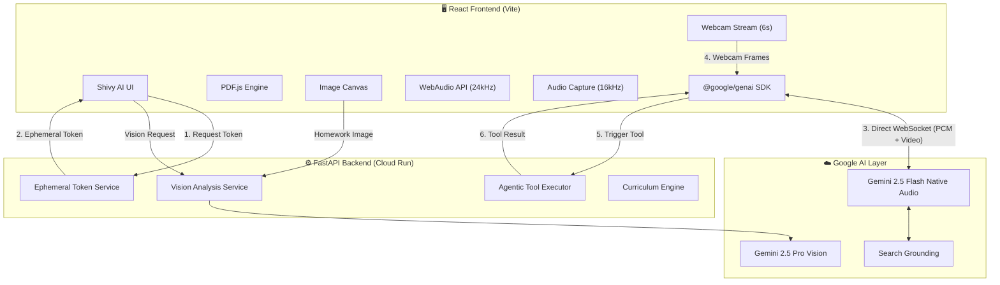

# 🎓 Shivy AI

> **The Future of School, Powered by AI**

🔗 **Live App:** [https://shivy-ai-kygarr5jkq-uc.a.run.app](https://shivy-ai-kygarr5jkq-uc.a.run.app)

**Built with:** `Python` · `FastAPI` · `React 19` · `Vite 7` · `Gemini 2.5 Flash Native Audio` · `Gemini 3 Flash` · `Gemini Vision` · `Google Search Grounding` · `@google/genai SDK` · `Ephemeral Tokens` · `PDF.js` · `Framer Motion` · `Docker` · `Google Cloud Run`

---

## Inspiration

Modern education relies heavily on static PDFs, textbooks, and one-way lectures. When a student doesn't understand a concept, they are forced to **leave their study material** — to search Google, watch a YouTube video, or use a generic ChatGPT interface. This breaks focus and strips away the direct context of what they were studying.

We were inspired to solve this by bringing a **proactive, multimodal AI agent directly into the textbook**. Instead of the student asking the AI questions in a separate chatbox, the AI:

- 👀 **Watches** the student study (sees the exact PDF page AND the student via webcam)
- 👂 **Listens** to their voice in real-time
- 🗣️ **Speaks back** with low-latency, natural voice tutoring
- 🧠 **Thinks** autonomously — triggering quizzes, visuals, dictation, and dictionary lookups without being asked
- 📹 **Monitors** behavior — detecting sleeping or camera-off through continuous webcam vision

---

## What it does

Shivy AI takes any uploaded textbook (PDF) and wraps it in a **multimodal AI orchestration layer**, transforming static studying into an interactive, AI-guided experience.

### 🎙️ 1. Real-time Spoken Tutor (Zero-Latency Voice)

At its core, Shivy AI features a **voice-first proactive tutor** powered by the **Gemini 2.5 Flash Native Audio** API.

| Feature | How it works |
|---|---|
| **Natural Conversation** | Students speak naturally; the AI responds in a warm, human-like voice with <500ms latency |
| **Direct Client-to-Server** | Browser connects directly to Gemini Live API via ephemeral tokens — no backend proxy, no double-hop |
| **True Barge-in** | Server-side VAD detects interruptions instantly — say "Wait, explain that again" mid-sentence |
| **Contextual Awareness** | The tutor reads the current PDF page text, analyzes visible diagrams, and adapts its teaching in real-time |
| **Secure by Design** | API key never leaves the backend — frontend uses short-lived, single-use ephemeral tokens |

### 🤖 2. Autonomous Agentic Behaviors

The AI tutor isn't just a chatbot — it acts as an **autonomous orchestration agent** that decides when to use its tools. When a tool is triggered, the corresponding **UI panel auto-opens instantly** with the generated content pre-loaded — the student never has to manually navigate anywhere.

| Tool | Trigger | What Happens |
|---|---|---|
| `generate_quiz` | After explaining a topic | **Assessment Panel auto-opens** with pre-loaded MCQs, True/False, and Fill-in-the-Blank questions — quiz starts immediately |
| `lookup_word` | Student encounters unfamiliar term | Google Search-grounded dictionary with IPA pronunciation, etymology, and contextual definition |
| `generate_visual` | Concept needs a picture | **Visual Canvas auto-opens** with the generated infographic, flowchart, or concept map displayed instantly |
| `log_discipline` | Student sleeping or camera off | 🚨 **Discipline flag logged** to Session Activity panel with timestamp. AI verbally nudges the student |
| `save_dictation_words` | After dictation review complete | 📝 Words are saved to **Session Activity** panel only after AI verifies spelling via webcam |
| `suggest_next_topic` | Student finishes a concept | AI guides them to the next logical topic based on curriculum and prerequisites |
| `create_bookmark` | Student highlights important text | Content is saved to the Knowledge Vault for revision |
| `summarize_page` | Page is dense or overwhelming | Generates concise bullet-point summaries of the current textbook page |
| `explain_like_im_5` | Student says "I still don't get it" | Simplifies concept with everyday analogies a child could understand |
| `compare_concepts` | Student confuses two similar terms | Side-by-side comparison showing similarities, differences, and a summary |
| `generate_flashcards` | Student finishes a chapter | Creates front/back revision flashcards for spaced repetition study |

> **Smart Tool Responses:** Tool results are split into two streams — the full rich data (quiz JSON, image bytes) goes to the frontend UI, while a lightweight status message goes back to the voice model. This prevents the AI from verbally reading out quiz questions or image data, keeping the conversation natural.

### 🖼️ 3. Visual Explainer (Nano Banana 2)

Some concepts are impossible to understand through text or voice alone.

- If a student says *"I'm confused about the Krebs Cycle"*, the orchestration agent triggers the **Visual Explainer**
- The UI seamlessly slides out a panel that generates an **infographic, flowchart, or concept map** on the fly
- These visuals are **grounded by Google Search** results, ensuring factual accuracy over hallucination
- The student can iteratively **refine** the visual: *"Make it simpler"* or *"Add more detail about ATP"*

### 👁️ 4. Native PDF Pixel Interactivity & Vision

We discarded the traditional "upload PDF and chat" paradigm in favor of **deep DOM integration**:

- **Click any word** → instant dictionary lookup with IPA pronunciation, etymology, subject-specific definition
- **Highlight a sentence** → save it to the **Knowledge Vault** for revision sheets
- **🔖 Save** from the tooltip → pushes word + definition to your vault
- **🎨 Visualize** from the tooltip → opens the Visual Explainer pre-filled with that concept
- **👁️ Explain Page & Diagrams** → extracts a **pixel-perfect snapshot** of the current page canvas (capturing all charts, graphs, images) and sends it to the **Gemini Vision model**. The voice tutor then **verbally explains the diagram** you are looking at.

### 📹 5. Continuous Webcam Vision & Discipline Tracking

The AI tutor **sees** the student through continuous webcam streaming:

- Webcam frames sent to Gemini every **6 seconds** for real-time monitoring
- **Discipline detection**: Sleeping (eyes closed, no movement) or camera-off triggers a verbal nudge + `log_discipline` tool with timestamp
- **Smart filtering**: Looking down at a book/writing is *normal* — only genuine issues flagged
- **Live webcam preview** in the left panel shows what the AI sees

### 📝 6. Contextual Dictation Homework

Interactive spelling practice based on the current textbook page:

- Student picks how many words (2, 3, or 5)
- Words dictated **one-by-one**, slowly sounded out (e.g. "Tok... en... i... zer")
- Student writes each word, says "Next" to advance
- Holds paper to **webcam** for AI-powered spelling review
- Words saved to **Session Activity** panel only *after* review and corrections

### 📖 7. Interactive Guided Reading

The AI reads aloud **paragraph by paragraph**, pausing after each to offer:

- **"Dictation"** → dictation exercise from that paragraph
- **"Quiz"** → auto-generates MCQ assessment via `generate_quiz`
- **"Help with a word"** → instant `lookup_word` tool call
- **"Next"** → continues reading
- Voice-activated (*"Read this page to me"*) or button-triggered

### 🖼️ 8. Image Uploads for Homework Review

Students upload **images of handwritten homework** (JPEG/PNG):

- Dedicated **Image Canvas** renders the image in the center
- **"Review Homework"** sends image to Gemini Vision for assessment
- AI gives feedback on handwriting, math solutions, spelling — via voice

---

## How we built it

### 🏗️ Architecture Diagram

### 🏗️ Architecture Diagram

Our system is a decoupled **React Frontend** and **FastAPI Python Backend**. The voice tutor uses Google's recommended **client-to-server** architecture — the browser connects **directly** to the Gemini Live API via short-lived ephemeral tokens, eliminating the backend WebSocket proxy for minimal latency. Tool execution stays server-side via REST endpoints.

### 🔊 Voice Tutor Data Flow

### 🧩 Technology Stack

| Layer | Technology | Purpose |
|---|---|---|
| **Frontend** | React 19, Vite 7 | Interactive SPA with glassmorphic UI |
| **Styling** | Vanilla CSS, Framer Motion | Premium animations and transitions |
| **PDF Engine** | PDF.js (Mozilla) | Pixel-perfect TextLayer over canvas for clickable words |
| **Image Canvas** | React + Canvas API | Renders uploaded homework images for AI review |
| **Audio** | WebAudio API | Precise `currentTime` scheduling for zero-lag playback |
| **Webcam** | MediaDevices + Canvas | Continuous 6s frame capture for discipline monitoring |
| **Backend** | Python, FastAPI | REST API + ephemeral token minting |
| **Voice AI** | Gemini 2.5 Flash Native Audio | Real-time bidirectional voice via direct client-to-server connection |
| **Security** | Ephemeral Tokens | Short-lived, single-use tokens — API key never leaves server |
| **Orchestrator** | Gemini 3 Flash Preview | Agent orchestration with tool calling |
| **Vision** | Gemini 2.5 Pro Vision | Page snapshot analysis + homework image review |
| **Search** | Google Search Grounding | Factual dictionary definitions and visual grounding |
| **Infra** | Docker, Cloud Run, `cloudbuild.yaml` | Automated containerized deployment |

---

## Challenges we ran into

| Challenge | Root Cause | Our Solution |
|---|---|---|
| 🔴 **Overengineered proxy** | Server-to-server WebSocket relay added latency + complexity + per-turn receive loop bug | Migrated to Google's recommended **client-to-server** architecture with ephemeral tokens |
| 🔴 **API key security** | Direct client connection risks exposing API key | Backend mints single-use, 1-min ephemeral tokens via `auth_tokens.create()` |
| 🟡 **20-30s audio lag** | Recursive `onended` event-loop queuing on main thread | Refactored to precise `AudioContext.currentTime` scheduling at 24kHz |
| 🟡 **PDF text misalignment** | Custom bounding-box detection was slow and inaccurate | Migrated to `pdf.js` native `TextLayer` for pixel-perfect DOM overlay |
| 🟡 **Infinite tool-call loop** | Sending full quiz/image JSON back to voice model caused it to re-trigger tools or read data aloud | Split data streams: rich payload → UI, lightweight status → voice model. Reduced audio `timeSlice` from 1s to 250ms for faster streaming |

---

## Accomplishments that we're proud of

✅ Achieving a truly **human-like, zero-latency conversation loop** that understands the exact visual context of what the student is reading

✅ Building **continuous webcam vision** that monitors student behavior while distinguishing normal study postures from genuine discipline issues

✅ Creating a **complete dictation homework loop** — AI dictates words, student writes them, holds paper to camera, AI verifies spelling — all via voice

✅ Implementing **interactive guided reading** where the AI reads paragraphs aloud and offers inline dictation, quizzes, and dictionary lookups

✅ Successfully coupling **deep agentic tools** (quiz generation, visual explainer, discipline tracking, dictation) into the real-time audio loop without blocking conversation

✅ **Seamless tool-to-UI integration** — when the voice agent triggers a quiz or visual, the correct panel auto-opens with data pre-loaded

✅ Designing a pristine, **glassmorphic SaaS UI** that feels premium — not a hackathon prototype

✅ Building **pixel-perfect interactive PDF text** where every word is clickable for instant dictionary lookups

✅ Setting up an **automated GCP Infrastructure-as-Code pipeline** using `cloudbuild.yaml` and Cloud Run

---

## What we learned

📘 The **client-to-server** pattern with ephemeral tokens is both simpler and faster than backend WebSocket proxying

📘 How to orchestrate **multi-model agent handoffs** — using Gemini-3-Flash for orchestration and Native Audio for the real-time voice loop

📘 **WebAudio scheduling** is critical for smooth playback — never rely on `onended` callbacks for real-time audio

📘 Practical experience in **automated cloud deployments** via Google Cloud Run and `cloudbuild.yaml`

📘 The importance of **client-side DOM integration** with `pdf.js` TextLayers for interactive document experiences

---

## What's next for Shivy AI

🚀 **Multi-student collaborative rooms** — multiple students join the same study session with the AI tutor moderating

🚀 **Long-term Knowledge Graphs** — storing the student's Knowledge Vault across years to predict future struggles

🚀 **Mobile Application** — porting to React Native for studying on the go

🚀 **Multi-language Support** — voice tutoring in Hindi, Spanish, and other languages

🚀 **Analytics Dashboard** — tracking study patterns, weak areas, and improvement over time

---

## 🧪 Reproducible Testing Instructions

Visit the live app at **[https://shivy-ai-kygarr5jkq-uc.a.run.app](https://shivy-ai-kygarr5jkq-uc.a.run.app)** and follow these steps:

### Test 1: Upload a PDF & Interactive Words
1. Open the live app in Chrome
2. Drag any PDF into the upload area on the left panel
3. **Click any word** on the rendered page → a dictionary tooltip appears with pronunciation, etymology, and definition
4. Click **🔖 Save** → the word appears in the **Knowledge Vault** (right panel)
5. **Highlight a multi-word phrase** → the same tooltip appears for the entire selection

### Test 2: Voice Tutor (Real-time Conversation)
1. With a PDF loaded, click **🎙 Start Tutor** in the left panel
2. Allow microphone access when prompted
3. **Speak naturally**: *"Can you explain what's on this page?"*
4. The AI should respond **within 1-2 seconds** with spoken audio
5. **Test barge-in**: while the AI is speaking, interrupt it by saying *"Wait, what does that mean?"* — it should stop and respond to your interruption

### Test 3: Dictation Homework
1. With Voice Tutor active, say **"Let's do a dictation exercise"** or click **📝 Start Dictation**
2. The AI asks how many words (2, 3, or 5)
3. It dictates words one-by-one, slowly sounding them out
4. Say **"Next"** after writing each word
5. Hold paper to **webcam** → AI reviews spelling
6. Words appear in **Session Activity** panel only after review

### Test 4: Guided Reading
1. With Voice Tutor active, say **"Read this page to me"** or click **📖 Guided Reading**
2. AI reads paragraph-by-paragraph, pauses after each
3. Say **"Dictation"**, **"Quiz"**, or ask about a word → AI triggers the tool
4. Say **"Next"** to continue

### Test 5: Discipline Tracking
1. With Voice Tutor active, **cover your webcam** or stay still with eyes closed 10+ seconds
2. AI verbally nudges you and logs a flag in the **Session Activity** panel with a timestamp
3. **Looking down at a book** should NOT trigger a false positive

### Test 6: Image Upload & Homework Review
1. Click **Add book** → upload a `.jpg` or `.png` image
2. **Image Canvas** renders in center panel
3. Click **👁️ Review Homework** → AI analyzes and gives feedback

### Test 7: Visual Explainer
1. Click any word on the PDF → dictionary tooltip appears
2. Click **🎨 Visualize** → Visual Explainer panel opens
3. Click **Generate** → AI-generated visual appears

### Test 8: Curriculum Planner
1. Click **📅 Study Planner** in the left panel
2. Set exam date and daily study hours → click **Generate Plan**
3. Week-by-week schedule appears

### Test 9: Cloud Health Check
1. Visit [https://shivy-ai-kygarr5jkq-uc.a.run.app/health](https://shivy-ai-kygarr5jkq-uc.a.run.app/health)
2. Expected: `{"status":"ok","service":"Shivy AI"}`

---

## ☁️ Cloud Deployment Proof

| Item | Details |
|---|---|
| **Live App** | [shivy-ai-kygarr5jkq-uc.a.run.app](https://shivy-ai-kygarr5jkq-uc.a.run.app) |
| **Health Check** | [/health](https://shivy-ai-kygarr5jkq-uc.a.run.app/health) |
| **Infrastructure-as-Code** | `cloudbuild.yaml` + `Dockerfile` included in repo |
